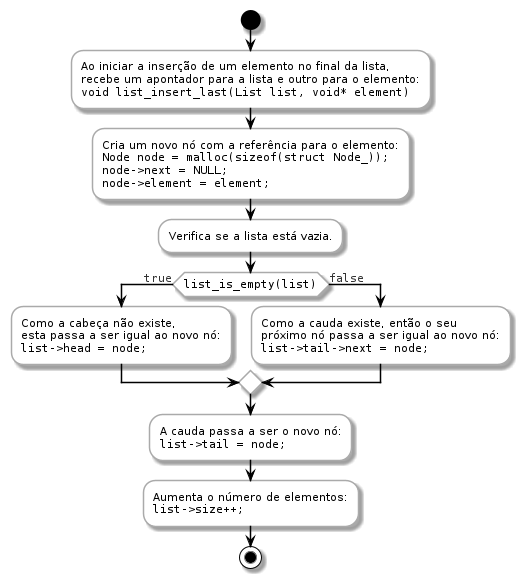

[](https://github.com/IADE-PA/lists/actions/workflows/Tests.yml)

# Programação e Algoritmos - IADE UE <!-- omit in toc -->

# Listas Ligadas <!-- omit in toc -->

- [Atualização do repositório](#atualização-do-repositório)
- [Testes unitários](#testes-unitários)
- [Utilização de memória pela lista simplesmente ligada](#utilização-de-memória-pela-lista-simplesmente-ligada)
  - [Criação da lista](#criação-da-lista)
  - [Inserir o primeiro elemento ao final da lista](#inserir-o-primeiro-elemento-ao-final-da-lista)
  - [Inserir o segundo elemento ao final da lista](#inserir-o-segundo-elemento-ao-final-da-lista)
  - [Inserir o terceiro elemento ao final da lista](#inserir-o-terceiro-elemento-ao-final-da-lista)
- [Operações da lista simplesmente ligada](#operações-da-lista-simplesmente-ligada)
  - [Inserção no final da lista](#inserção-no-final-da-lista)

## Atualização do repositório

Para obter as alterações mais recentes ao repositório é necessário:

1. Registar o repositório como referência remota `upstream`:

        git remote add upstream https://github.com/IADE-PA/linked-lists

2. Obter as alterações para a máquina local:

        git fetch upstream

3. Propagar as alterações para o repositório local:

        git checkout upstream/main .

## Testes unitários

A bateria de testes unitários pode ser executada com

        make tests

## Utilização de memória pela lista simplesmente ligada

Vamos considerar um cenário de utilização da lista simplesmente ligada, com o detalhe fundamental das consequências das várias operações na memória É também apresentado um diagrama com o estado atual da lista, no ponto de vista do utilizador.

### Criação da lista

```Text
                                    +
                                    |  | Endereço | Valor                          | Variável |
List list = list_create();          |  | -------- | ------------------------------ | -------- |
                                    | >| 0x00     | {head=NULL, tail=NULL, size=0} | list     |
                                    +
Diagrama:

head, tail
........
: NULL :
........
```

### Inserir o primeiro elemento ao final da lista

1. Criação de um elemento

```Text
                                    +
                                    |  | Endereço | Valor                          | Variável |
int element1 = 42;                  |  | -------- | ------------------------------ | -------- |
                                    |  | 0x00     | {head=NULL, tail=NULL, size=0} | list     |
                                    | >| 0x01     | (int) 42                       | element1 |
                                    +
Diagrama:

head, tail
........
: NULL :
........
```

2. Inserir o endereço do elemento no final da lista. Internamente, a lista começa por criar um novo nó, que vai guardar o endereço do elemento.

```Text
                                    +
                                    |  | Endereço | Valor                          | Variável |
list_insert_last(list, &element1);  |  | -------- | ------------------------------ | -------- |
                                    |  | 0x00     | {head=NULL, tail=NULL, size=0} | list     |
                                    |  | 0x01     | (int) 42                       | element1 |
                                    | >| 0x02     | {next=NULL, element=0x01}      | node1    |
                                    +
Diagrama:

 head, tail      +------+
 ........        |      |
 : NULL :        |  42  |
 ........        |      |
                 +------+
                   node1

```

3. Com o novo nó criado, é necessário atualizar os apontadores para `head` e `tail`, e o número de elementos da lista.

```Text
                                    +
                                    |  | Endereço | Valor                          | Variável |
list_insert_last(list, &element1);  |  | -------- | ------------------------------ | -------- |
                                    | >| 0x00     | {head=0x02, tail=0x02, size=1} | list     |
                                    |  | 0x01     | (int) 42                       | element1 |
                                    |  | 0x02     | {next=NULL, element=0x01}      | node1    |
                                    +
Diagrama:

head,tail
+------+
|      |
|  42  |
|      |
+------+
  node1
```

### Inserir o segundo elemento ao final da lista

1. Criação do segundo elemento. A lista não é alterada.

```Text
                                    +
                                    |  | Endereço | Valor                          | Variável |
int element2 = 99;                  |  | -------- | ------------------------------ | -------- |
                                    |  | 0x00     | {head=0x02, tail=0x02, size=1} | list     |
                                    |  | 0x01     | (int) 42                       | element1 |
                                    |  | 0x02     | {next=NULL, element=0x01}      | node1    |
                                    | >| 0x03     | (int) 99                       | element2 |
                                    +
Diagrama:

head,tail
+------+
|      |
|  42  |
|      |
+------+
  node1
```

2. Inserir o endereço do segundo elemento no final da lista. Internamente, a lista volta a criar um novo nó, que vai guardar o endereço do elemento.

```Text
                                    +
                                    |  | Endereço | Valor                          | Variável |
list_insert_last(list, &element2);  |  | -------- | ------------------------------ | -------- |
                                    |  | 0x00     | {head=0x02, tail=0x02, size=1} | list     |
                                    |  | 0x01     | (int) 42                       | element1 |
                                    |  | 0x02     | {next=NULL, element=0x01}      | node1    |
                                    |  | 0x03     | (int) 99                       | element2 |
                                    | >| 0x04     | {next=NULL, element=0x03}      | node2    |
                                    +
Diagrama:

head,tail
+------+      +------+
|      |      |      |
|  42  |      |  99  |
|      |      |      |
+------+      +------+
  node1         node2

```

3. Para manter a lista coerente, é necessário indicar que o próximo nó da cauda atual é o novo nó inserido na lista.

```Text
                                    +
                                    |  | Endereço | Valor                          | Variável |
list_insert_last(list, &element2);  |  | -------- | ------------------------------ | -------- |
                                    |  | 0x00     | {head=0x02, tail=0x02, size=1} | list     |
                                    |  | 0x01     | (int) 42                       | element1 |
                                    | >| 0x02     | {next=0x04, element=0x01}      | node1    |
                                    |  | 0x03     | (int) 99                       | element2 |
                                    |  | 0x04     | {next=NULL, element=0x03}      | node2    |
                                    +
Diagrama:

head,tail     
+------+      +------+
|      |      |      |
|  42  |----->|  99  |
|      |      |      |
+------+      +------+
  node1         node2

```

4. Por último, a cauda passa a ser o novo nó inserido na lista, e o número de elementos é incrementado.

```Text
                                    +
                                    |  | Endereço | Valor                          | Variável |
list_insert_last(list, &element2);  |  | -------- | ------------------------------ | -------- |
                                    | >| 0x00     | {head=0x02, tail=0x04, size=2} | list     |
                                    |  | 0x01     | (int) 42                       | element1 |
                                    |  | 0x02     | {next=0x04, element=0x01}      | node1    |
                                    |  | 0x03     | (int) 99                       | element2 |
                                    |  | 0x04     | {next=NULL, element=0x03}      | node2    |
                                    +
Diagrama:

  head          tail
+------+      +------+
|      |      |      |
|  42  |----->|  99  |
|      |      |      |
+------+      +------+
  node1         node2

```

### Inserir o terceiro elemento ao final da lista

1. Criação do terceiro elemento. A lista não é alterada.

```Text
                                    +
                                    |  | Endereço | Valor                          | Variável |
int element3 = 7;                   |  | -------- | ------------------------------ | -------- |
                                    |  | 0x00     | {head=0x02, tail=0x04, size=2} | list     |
                                    |  | 0x01     | (int) 42                       | element1 |
                                    |  | 0x02     | {next=0x04, element=0x01}      | node1    |
                                    |  | 0x03     | (int) 99                       | element2 |
                                    |  | 0x04     | {next=NULL, element=0x03}      | node2    |
                                    | >| 0x05     | (int) 7                        | element3 |
                                    +
Diagrama:

  head          tail
+------+      +------+
|      |      |      |
|  42  |----->|  99  |
|      |      |      |
+------+      +------+
  node1         node2
```

2. Inserir o endereço do terceiro elemento no final da lista. Internamente, a lista volta a criar um novo nó, que vai guardar o endereço do elemento.

```Text
                                    +
                                    |  | Endereço | Valor                          | Variável |
list_insert_last(list, &element3);  |  | -------- | ------------------------------ | -------- |
                                    |  | 0x00     | {head=0x02, tail=0x04, size=2} | list     |
                                    |  | 0x01     | (int) 42                       | element1 |
                                    |  | 0x02     | {next=0x04, element=0x01}      | node1    |
                                    |  | 0x03     | (int) 99                       | element2 |
                                    |  | 0x04     | {next=NULL, element=0x03}      | node2    |
                                    |  | 0x05     | (int) 7                        | element3 |
                                    | >| 0x06     | {next=NULL, element=0x05}      | node3    |
                                    +
Diagrama:

  head          tail
+------+      +------+      +------+
|      |      |      |      |      |
|  42  +----->+  99  |      |  7   |
|      |      |      |      |      |
+------+      +------+      +------+
  node1         node2         node3
```

3. Volta a ser necessário atualizar o próximo nó da cauda atual com o novo nó inserido na lista.

```Text
                                    +
                                    |  | Endereço | Valor                          | Variável |
list_insert_last(list, &element3);  |  | -------- | ------------------------------ | -------- |
                                    |  | 0x00     | {head=0x02, tail=0x04, size=2} | list     |
                                    |  | 0x01     | (int) 42                       | element1 |
                                    |  | 0x02     | {next=0x04, element=0x01}      | node1    |
                                    |  | 0x03     | (int) 99                       | element2 |
                                    | >| 0x04     | {next=0x06, element=0x03}      | node2    |
                                    |  | 0x05     | (int) 7                        | element3 |
                                    |  | 0x06     | {next=NULL, element=0x05}      | node3    |
                                    +
Diagrama:

  head          tail
+------+      +------+      +------+
|      |      |      |      |      |
|  42  +----->+  99  |----->|  7   |
|      |      |      |      |      |
+------+      +------+      +------+
  node1         node2         node3
```

4. Voltamos a atualizar a cauda para o novo nó inserido na lista, e a incrementar o número de elementos.

```Text
                                    +
                                    |  | Endereço | Valor                          | Variável |
list_insert_last(list, &element3);  |  | -------- | ------------------------------ | -------- |
                                    | >| 0x00     | {head=0x02, tail=0x06, size=3} | list     |
                                    |  | 0x01     | (int) 42                       | element1 |
                                    |  | 0x02     | {next=0x04, element=0x01}      | node1    |
                                    |  | 0x03     | (int) 99                       | element2 |
                                    |  | 0x04     | {next=0x06, element=0x03}      | node2    |
                                    |  | 0x05     | (int) 7                        | element3 |
                                    |  | 0x06     | {next=NULL, element=0x05}      | node3    |
                                    +
Diagrama:

  head                        tail
+------+      +------+      +------+
|      |      |      |      |      |
|  42  +----->+  99  |----->|  7   |
|      |      |      |      |      |
+------+      +------+      +------+
  node1         node2         node3
```

## Operações da lista simplesmente ligada

### Inserção no final da lista

O algoritmo de inserção no final da lista é o seguinte:


